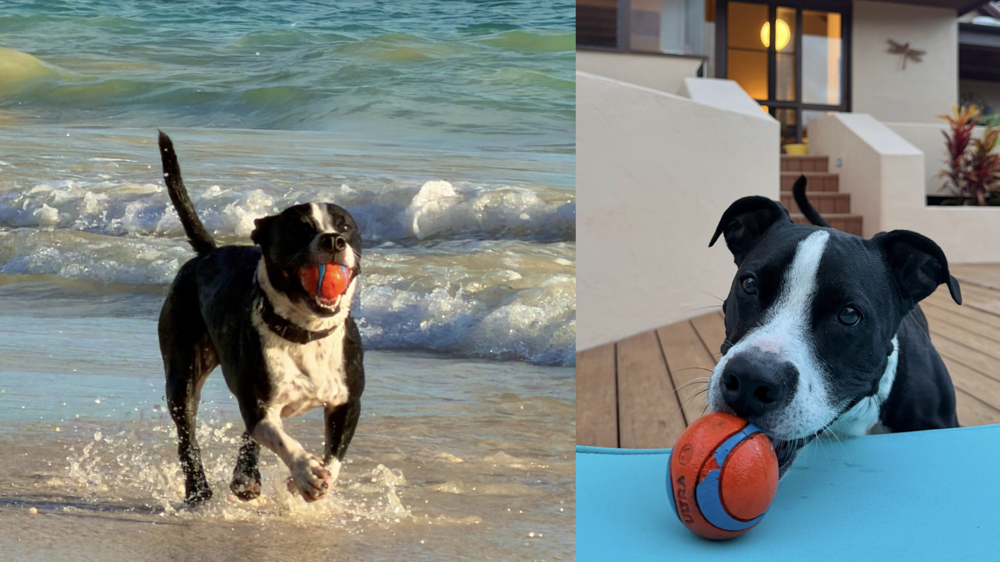
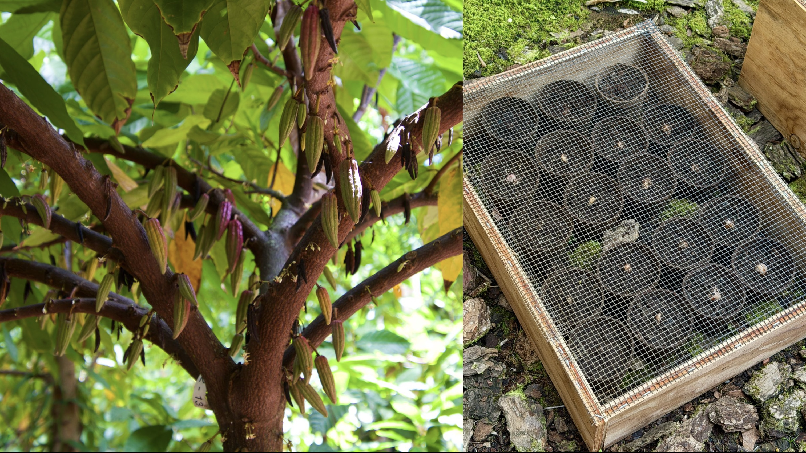

<section class="dkh-hero">
  <h1 class="dkh-hero__heading">Hi! I'm David, a </h1>
  

    I spent my formative years in Tokyo, navigated adolescence in Hawai'i, then moved to the UK to study the brain and behavior. I'm interested in all aspects of the human condition, but especially the neurobiology of reward and how it can be usurped — by disease and by design.  
    I built this site so you can learn more <a href="about/">about me</a> and check out some of <a href="gallery/">my photos</a>. I'm also trying to create stuff more consistently (and conscientiously!) <a href="epilogue/">here</a>, and I'm working on developing an accessible, foundation-level neuroscience curriculum, soon to be <a href="off-syllabus/">here</a>.
  

</section>

<section class="dkh-columns">
  

    <h2 class="dkh-box__title">Latest</h2>

    

      
Camera Roll

      

        <button type="button" class="dkh-box__cameraroll-nav dkh-box__cameraroll-nav--prev" aria-label="Previous photo"></button>
        <button type="button" class="dkh-box__cameraroll-nav dkh-box__cameraroll-nav--next" aria-label="Next photo"></button>
        

          <figure class="dkh-box__photo">
            

              
            

            <figcaption><strong>Mid-Aug '26:</strong> Family time at Winston's beck and <del>call</del> ball...</figcaption>
          </figure>
          <figure class="dkh-box__photo">
            

              
            

            <figcaption><strong>Early Aug '26:</strong> <a class="dkh-box__plain-link" href="https://manoachocolate.com/pages/farm-tours" target="_blank" rel="noopener noreferrer">Toured</a> a cacao farm, then decided to start one...</figcaption>
          </figure>
        

      

    

    

      
From My Desk 🖊

      

        <a class="dkh-box__writing" href="https://davidkhays.substack.com/p/introducing-epilogue" target="_blank" rel="noopener noreferrer">
          Sep 2026 &middot; Substack
          Introducing EPILOGUE
        </a>
        <a class="dkh-box__writing" href="siteception/">
          Aug 2026 &middot; Webpage
          A long time coming: The story of this website (+ tutorial)
        </a>
      

    

    

      
On My Mind

      
A lot! Too much, probably, in my busiest summer yet (at least mentally). I can't tell if I'm at the beginning or the end of my salad days; either way, it doesn't feel like the peak. The only way out is through!

    

  

  

    <h2 class="dkh-box__title">On Deck</h2>

    

      
Working Memory

      

        

          
Building this website60%

          

        

        

          
Summer in Hawai'i—

          

        

        

          
Writing my first textbook chapter20%

          

        

        

          
Applying to doctorate programs10%

          

        

      

    

    

      
Milestones

      

        

          
Degree ceremony (watch live on <a href="https://www.youtube.com/@EducationalMediaServices" target="_blank" rel="noopener noreferrer" class="dkh-box__plain-link">YouTube</a>)

          
—

        

        

          
My 22nd Christmas

          
—

        

      

    

    

      
Goals

      
2026 is <strong>—%</strong> over. By 2027, I will:

      <ol class="dkh-box__list">
        <li>Submit a competitive DPhil app with ≥2 papers in pre-print or under review.</li>
        <li>Launch <a href="epilogue/" class="dkh-box__plain-link dkh-box__plain-link--medium">EPILOGUE</a> on two platforms.</li>
        <li>Visit and document ≥1 new country!</li>
      </ol>
    

  

  

    <h2 class="dkh-box__title">Some Things I Believe</h2>
    <ul class="dkh-box__list">
      <li>The human condition is unfathomably terrifying, but equally beautiful.</li>
      <li>We are all equal as impostors, living for the first time, making it up as we go.</li>
      <li>Gratitude, forgiveness, and radical acceptance are healthier than trying to reason with an unfair universe.</li>
      <li>Fear of the event is worse than the event. (–Ray D. Thrower <a href="https://www.aderholdfh.com/obituaries/ray-d-thrower" target="_blank" rel="noopener noreferrer" class="dkh-box__list-icon-link">📎</a>)</li>
      <li>Time, comedy, and company are the best medicines for the heart.</li>
      <li>Sometimes all you need is to call a friend. Or to talk to anyone at all!</li>
      <li>Aesthetics have an inevitable influence on "objective" content assessment.</li>
      <li>Dichotomies are cognitively convenient but usually false and harmful.</li>
      <li>Complaining is rarely more effective than acting or adapting.</li>
      <li>Smiling at strangers makes the world a better place. :)</li>
      <li>Ultimately, it’s all about love. <a href="https://youtu.be/TJ4K5WFWIuw?si=jMNcLz2mvUaTSfGk&t=343" target="_blank" rel="noopener noreferrer" class="dkh-box__list-icon-link">📎</a></li>
      <li>No love, however brief, is wasted. <a href="https://x.com/louisethebaker/status/1379961867922239497" target="_blank" rel="noopener noreferrer" class="dkh-box__list-icon-link">📎</a></li>
      <li>Everything works out in the end.</li>
    </ul>
  

</section>
